# Car Price Prediction

This repository contains code for a car price prediction model using a Random Forest Regressor. We aim to predict car prices based on various car attributes through data cleaning, exploration, feature engineering, model training, and evaluation.

---

## Table of Contents

- [Installation](#installation)
- [How to Run](#how-to-run)
- [Data Exploration](#data-exploration)
- [Data Cleaning](#data-cleaning)
- [Data Visualization](#data-visualization)
- [Model Training](#model-training)
- [Model Evaluation](#model-evaluation)

---

## Installation

1. **Clone the repository:**
   ```bash
   git clone https://github.com/Austinkuria/Car-Price-Prediction.git
   cd Car-Price-Prediction
   ```

2. **Create a virtual environment:**
   Set up a virtual environment to keep dependencies isolated:
   ```bash
   python -m venv .venv
   ```

3. **Activate the virtual environment:**
   ```bash
   .venv\Scripts\activate  # On Windows
   source .venv/bin/activate  # On macOS/Linux
   ```

4. **Install required dependencies:**
   Use `pip` to install all necessary libraries:
   ```bash
   pip install -r requirements.txt
   ```

---

## How to Run

1. **Navigate to the project folder:**
   ```bash
   cd Car-Price-Prediction
   ```

2. **Activate the virtual environment** (if not already active):
   ```bash
   .venv\Scripts\activate  # On Windows
   source .venv/bin/activate  # On macOS/Linux
   ```

3. **Run the Jupyter Notebook:**
   Start Jupyter and open the notebook to run the project code:
   ```bash
   jupyter notebook
   ```
   This will open a browser window where you can access `car_price_prediction.ipynb`.

---

### Load the Dataset

```python
import numpy as np
import pandas as pd
import matplotlib.pyplot as plt
import seaborn as sns
import plotly.express as px
import warnings

warnings.filterwarnings('ignore') 
df = pd.read_csv('Car_Price_Data.csv')
```

## Data Exploration
We first explore the dataset to understand its structure and identify any missing values.

```python
df.info()
df.head()
df.isna().sum()
df['CarName'].unique()
```

---

## Data Cleaning

### Cleaning the CarName Column

We standardize the `CarName` column by fixing inconsistencies and misspellings.

```python
def clean_car_name(car_name):
    return car_name.split(" ")[0].lower()

df['CarName'] = df['CarName'].apply(clean_car_name)
df['CarName'] = df['CarName'].replace({
    'vw': 'volkswagen',
    'vokswagen': 'volkswagen',
    'toyouta': 'toyota',
    'maxda': 'mazda',
    'porcshce': 'porsche'
})
```

---

## Data Visualization

We use count plots to visualize the distribution of categorical variables such as `CarName`, `fueltype`, and `aspiration`.

```python
def count_plot(column, data):
    plt.figure(figsize=(12, 4))
    sns.set(style="whitegrid")
    ax = sns.countplot(data=data, x=column)
    plt.show()
```
---

- **Car Name**
  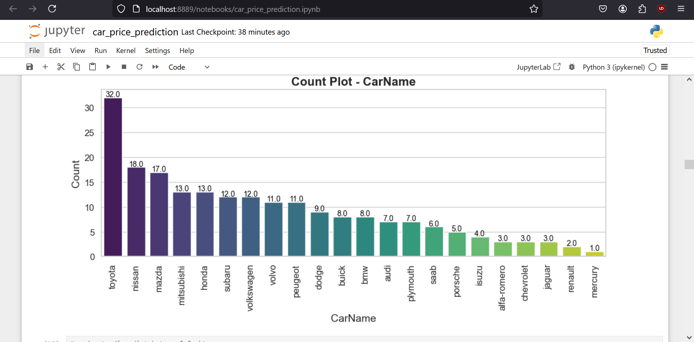

---

- **Fuel Type**
  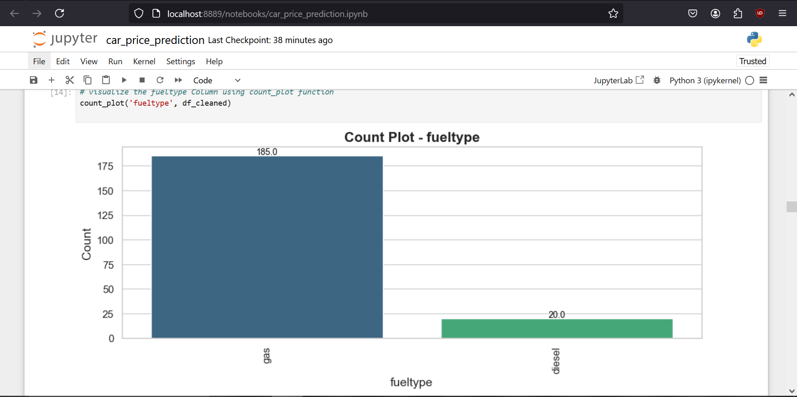

---

- **Aspiration**
  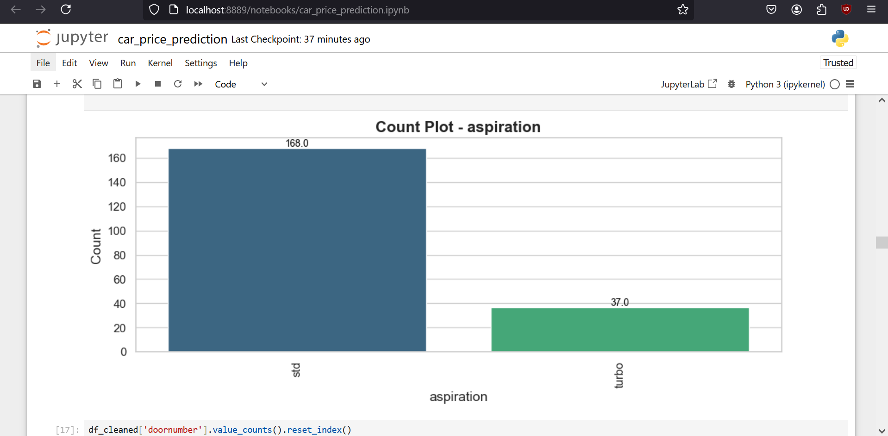

---

- **Car Body**
    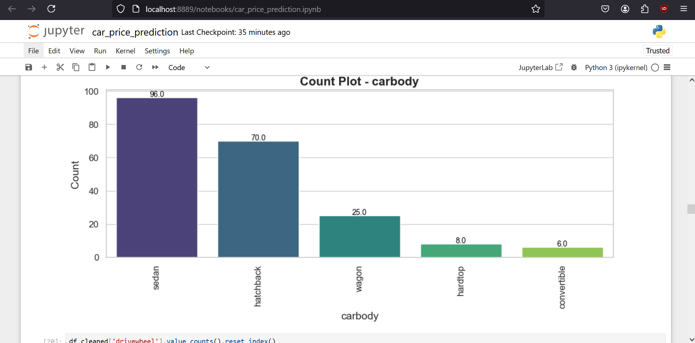

---

- **Drive Wheel**
    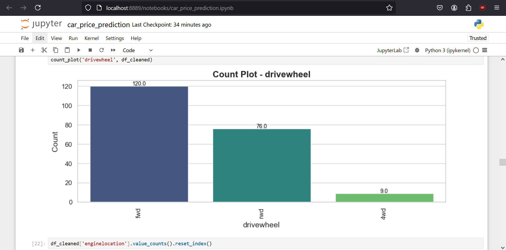

---

- **Engine Type**
    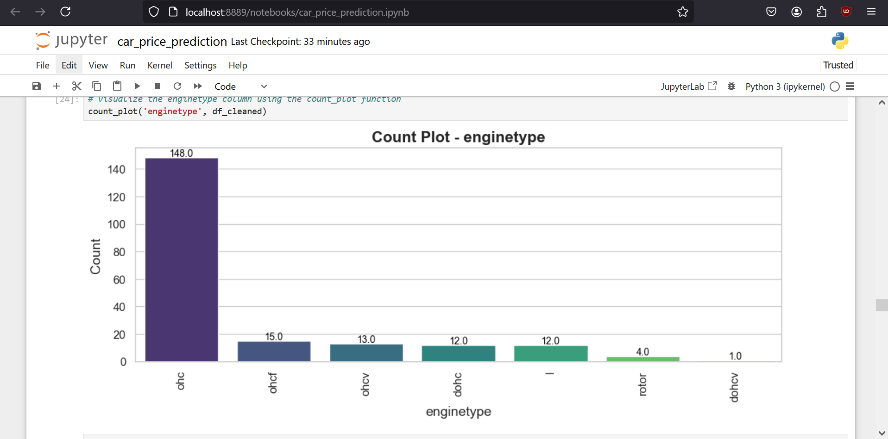

---

- **Fuel System**
    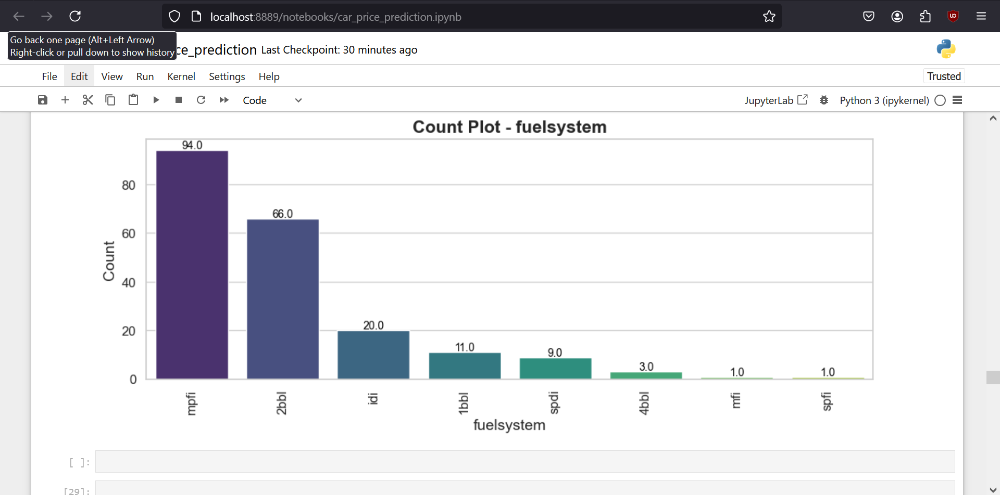

---

- **Cylinder Number**
    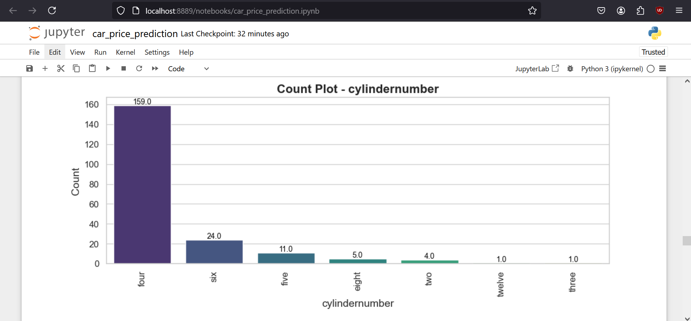

---

### Numerical Feature Distribution

We use histograms to visualize the distribution of numerical features like `wheelbase`, `curbweight`, and `horsepower`.

```python
def histogram(column_name, data):
    plt.figure(figsize=(12, 8))
    sns.histplot(data[column_name], kde=True, color='blue')
    plt.show()
```

- **Wheelbase**
  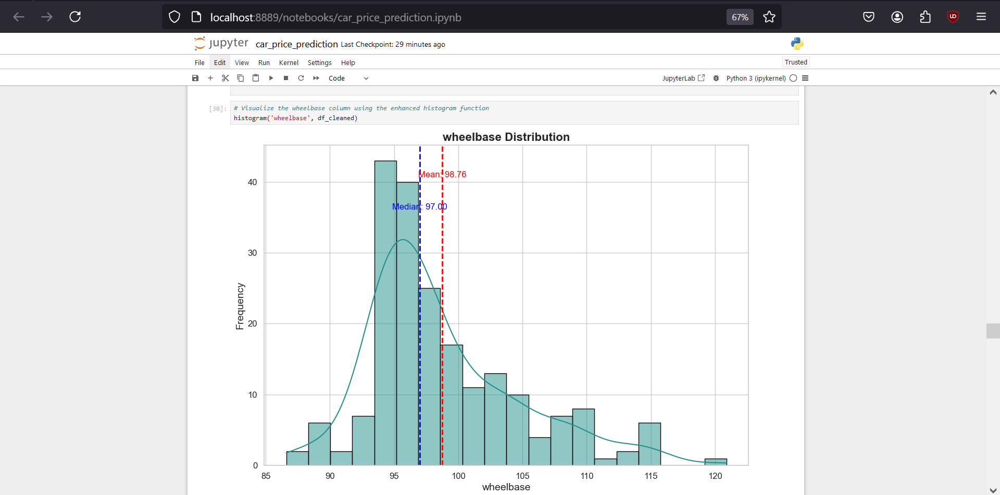

---

- **Curbweight**
  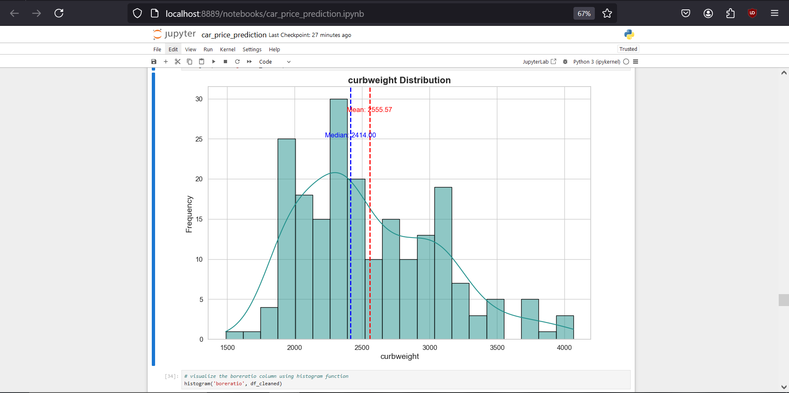

---

- **Carlength**
  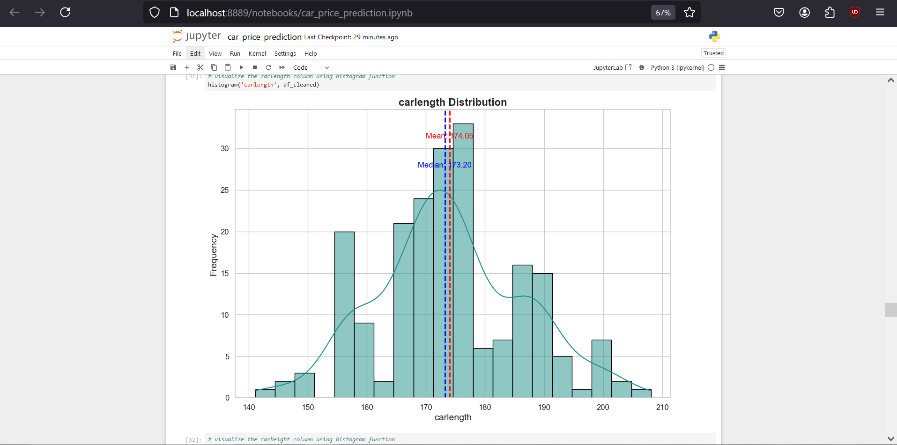

---

- **Carheight**
  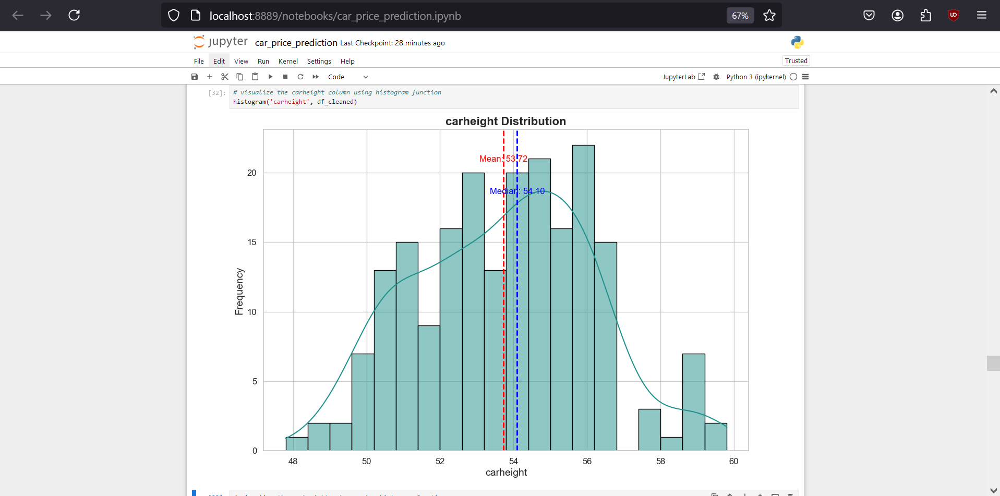

---

- **Horsepower**
  

---

- **Boreratio**
  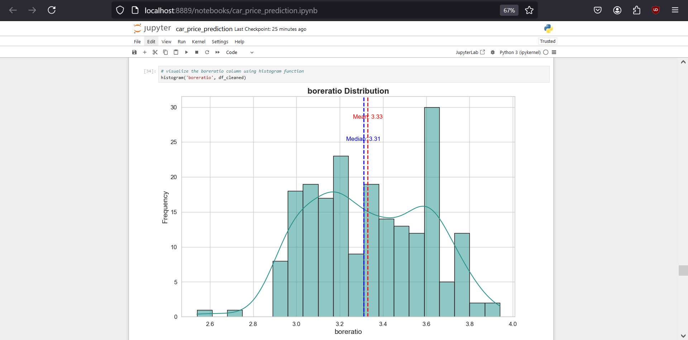

---

### Correlation Analysis

We create a heatmap to observe correlations between numerical variables.

```python
correlation_matrix = df.corr()
sns.heatmap(correlation_matrix, annot=True, cmap='Blues')
plt.show()
```

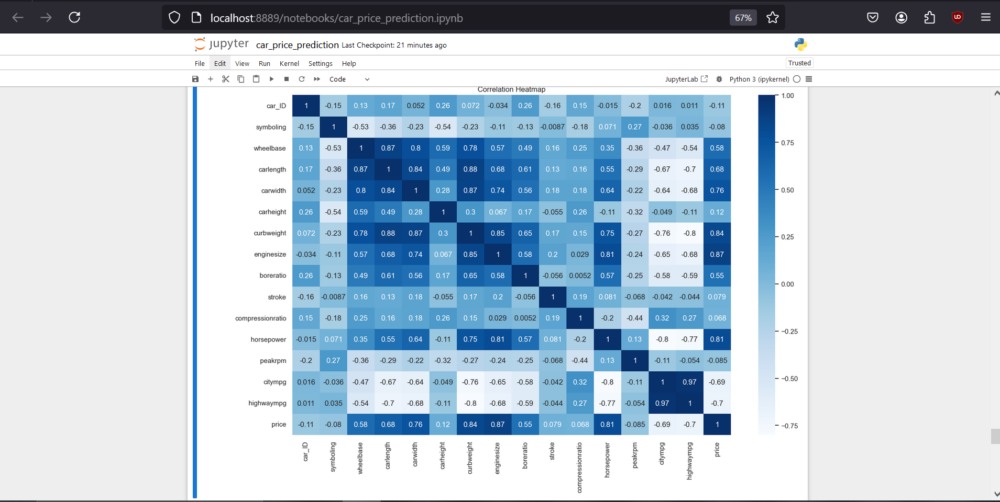

---

## Data Preprocessing

We preprocess the dataset by:
- Dropping unnecessary columns
- Encoding categorical variables
- Scaling numerical features

```python
from sklearn.preprocessing import StandardScaler, LabelEncoder

label_encoder = LabelEncoder()
for column in categorical_columns:
    df[column] = label_encoder.fit_transform(df[column])

scaler = StandardScaler()
df[numerical_columns] = scaler.fit_transform(df[numerical_columns])
```

---

## Model Training

1. **Splitting Data:**
   We split the data into training and testing sets.

   ```python
   from sklearn.model_selection import train_test_split
   X = df.drop(['price', 'CarName'], axis=1)
   y = df['price']
   X_train, X_test, y_train, y_test = train_test_split(X, y, test_size=0.2, random_state=42)
   ```

2. **Random Forest Regressor:**
   We train a Random Forest Regressor model.

   ```python
   from sklearn.ensemble import RandomForestRegressor
   rf_model = RandomForestRegressor(n_estimators=100, random_state=42)
   rf_model.fit(X_train, y_train)
   ```

---

## Model Evaluation

We evaluate the model using R-squared and Mean Squared Error (MSE). Cross-validation is also applied to get a more robust evaluation.

```python
from sklearn.metrics import mean_squared_error, r2_score
from sklearn.model_selection import cross_val_score

y_pred_test = rf_model.predict(X_test)
mse = mean_squared_error(y_test, y_pred_test)
r2_square = r2_score(y_test, y_pred_test)
cv_scores = cross_val_score(rf_model, X, y, cv=5)
```

---

### Results

- **Training R-squared**: 0.98
- **Testing R-squared**: 0.96
- **Mean Squared Error**: 0.05
- **Cross-validation Mean Score**: 0.37

---

### Learning Curves and Residuals

We analyze learning curves to understand training and cross-validation scores at various training sizes.

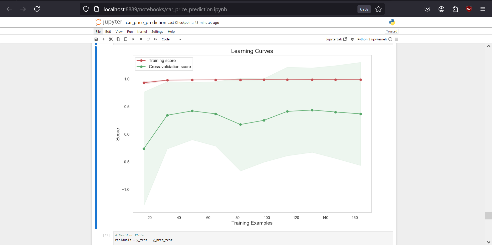

#### Residual Plot
The residuals plot allows us to check for any patterns or outliers.

```python
residuals = y_test - y_pred_test
sns.histplot(residuals, kde=True, color='blue')
plt.show()
```

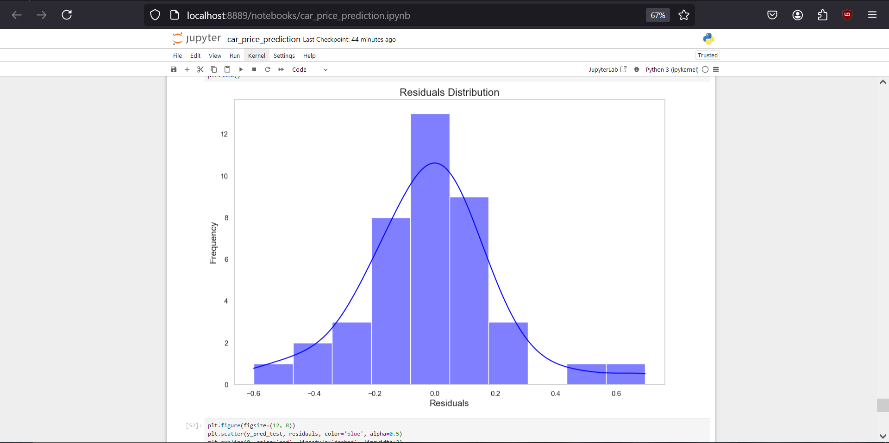

#### Residuals vs Predicted
This scatter plot verifies if residuals are evenly distributed around zero.

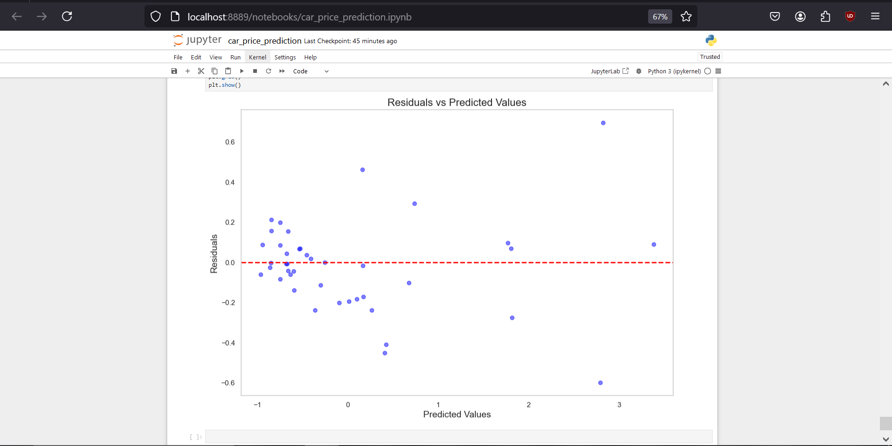

---

## Conclusions

- The model achieves a high R-squared value on both training and testing data.
- The residual plot and learning curves indicate that the model is robust and not overfitting.

---
